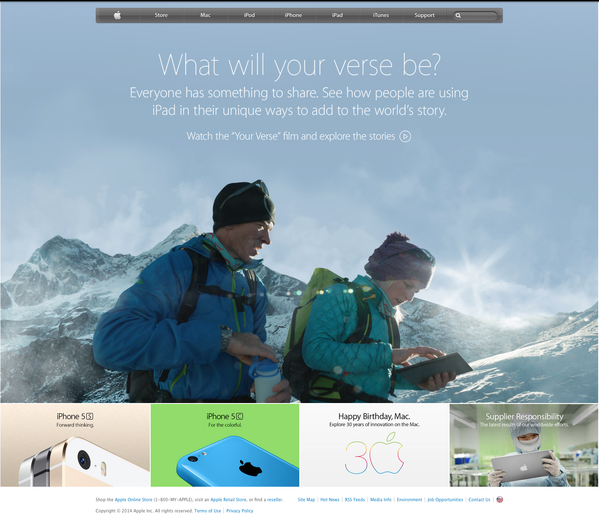

# Background and Gradients

> Replicate the Apple website from March, 2014.

This project consists of building an HTML document that matches the appearance of Apple.com website rendered in March, 2014 (See above screenshot for reference)

## Built With

- HTML.
- CSS.

## Live Demo

[Live Demo Link](https://raw.githack.com/santiagorodriguezbermudez/backgroundandgradients/create-homepage/index.html)

## Authors

👤 **Santiago Rodriguez**

- Github: [@santiagorodriguezbermudez](https://github.com/santiagorodriguezbermudez)
- Twitter: [@srba87](https://twitter.com/srba87)
- Linkedin: [srba87](https://www.linkedin.com/in/srba87/)

## 🤝 Contributing

Contributions, issues and feature requests are welcome!

Feel free to check the [issues page](issues/).

## Show your support

Give a ⭐️ if you like this project!

## 📝 License

This project is [MIT](lic.url) licensed.